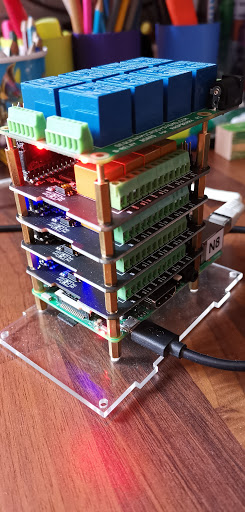

# Docker container for i2C relays

This project allows to control i2C relays via REST APIs. It includes a web server that allows to change the relay status, their names and notes.

I use this project to control the power of multiple ARM / x86 Kubernetes nodes so I can reset them from remote in case of need. I also use it to shutdown those Raspberry PIs that I am not using all the time such as test nodes.

This project is based on the [Seeed-Studio-Relay-Board](https://github.com/johnwargo/Seeed-Studio-Relay-Board) but I have heavily restructured the code to allow it to be more modular so it can support any number of stacked devices. I plan to run with 16 relays on my setup.

It is intended to run inside a docker container but you might also run it [directly](app/start-server.sh).

## Ideas to Implement
- [ ] Add automated multi-arch builds with drone.io
- [ ] Add mockup for unit test
- [x] show device bus and addresses on UI
- [x] allow adding and removing devices from the webpage
- [ ] allow discovering devices automatically

## Hardware Components

To use this project, you'll need at a minimum the following hardware components:

+ [Raspberry Pi 3](https://www.raspberrypi.org/products/raspberry-pi-3-model-b/)
+ One or more [supported relay board(s)](#supported-relay-boards)
+ 5V, 2.5A Micro USB power source (basically, a smartphone charger) - I use the [CanaKit 5V 2.5A Raspberry Pi 3 Power Supply/Adapter/Charger](https://www.amazon.com/gp/product/B00MARDJZ4)

### Supported relay boards

Unfortunately it seems that each producer has found a different way to manage their relays so some dedicated code is need for each. Bellow are the ones I have added:
+ [DockerPi 4 Channel Relay SKU: EP-0099](https://wiki.52pi.com/index.php/DockerPi_4_Channel_Relay_SKU:_EP-0099). I bought mine at [Amazon](https://www.amazon.de/gp/product/B07MV1TJGR) for 15€.
+ [Sequent Microsystems 8-RELAY Stackable Card for Raspberry Pi](https://www.sequentmicrosystems.com/8relays.html)
+ [Seeed Studio Raspberry Pi Relay Board v1.0](https://www.seeedstudio.com/Raspberry-Pi-Relay-Board-v1.0-p-2409.html). I have not tested it myself - open an issue if it does not.

More relay board types can be supported by adding the corresponding file under _app/relayType_

## Getting started

1. Follow the instructions from your relay board to install the HW.
2. [Enable i2c](#enabling-i2c).
2. Install Docker
3. `docker run --privileged -p 1080:1080 -v /etc/i2c-relay:/config -d --restart=always angelnu/i2c-relay`
   - privileged is needed to access i2c bus - this should also work just by sharing the specific I2C device
   - docker container started as daemon with auto-restart
   - list of relays will be stored in the docker volume `/etc/i2c-relay`
4. connect to `http://Raspberry-IP:1080`.
5. [scan for relays](#scan-i2c-bus).
6. [Add relays](#adding-relays).
7. Try your relays.
8. Terminate your docker container and consider starting it automatically on each reboot. You might use [Kubernetes](https://github.com/angelnu/homecloud/blob/master/services/relays.yaml) for that.

### Enabling i2c

Download the latest version of the Raspbian OS from the [Raspberry Pi web site](https://www.raspberrypi.org/downloads/raspbian/) and follow the [instructions](https://www.raspberrypi.org/documentation/installation/installing-images/README.md) for writing the OS image to a Micro SD card for the Pi. Insert the **SD card** in the Pi, connect **Ethernet**, **keyboard**, **mouse**, and a **monitor** to the Pi and finally **power it up** using a smartphone charger or some suitable power source.

The relay board communicates with the Raspberry Pi using the I2C interface. This interface is disabled by default on Raspbian, so the first thing you'll want to do is open the **Raspberry Pi menu** (in the upper-left corner of the screen), select **Preferences**, then **Raspberry Pi Configuration** as shown in the following figure:

In the **Raspberry Pi Configuration** application, select the **Interfaces** tab and enable the I2C radio button.

Raspbian comes configured with its keyboard, timezone, and other locale settings configured for the United Kingdom (UK), so if you're in the US, or elsewhere that's not the UK, you'll want to switch over to the **localisation** tab and adjust the settings there as well.

When you're done configuring I2C and the locale settings, you'll likely be prompted to reboot the Pi. Go ahead and do that before continuing.

### Scan i2c bus

You can use the web interface to scan button to scan for devices in your i2c bus:

In this example, it's showing that there are 4 devices at I2C addresses 0x10 - 0x13. You need to remember these addresses in oder to add the relays by clicking in _Add relays_. If you have other I2C devices beyond relays please ignore those.

### Adding relays

With the address detected [before](#scan-i2c-bus) you can click in the the _Add relays_ button to add relays to control. The dialog will not close until you click on _Close_ so you can add multiple relays without having to reopen the dialog.

