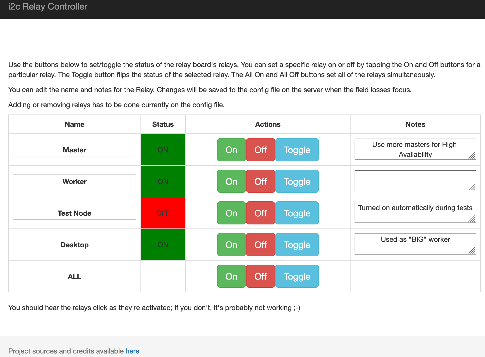
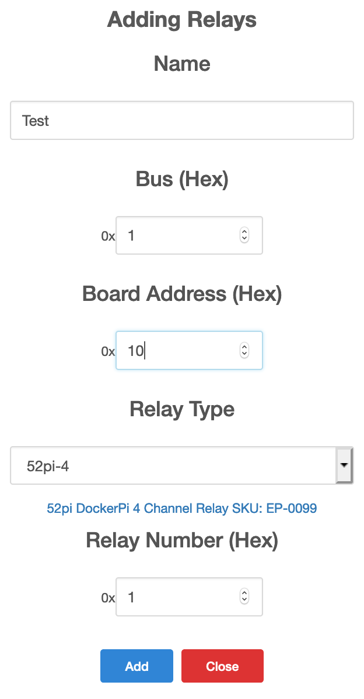

# Docker container for i2C relays

This project allows to control i2C relays via REST APIs. It includes a web server that allows to change the relay status, their names and notes.

I use this project to control the power of multiple ARM / x86 Kubernetes nodes so I can reset them from remote in case of need. I also use it to shutdown those Raspberry PIs that I am not using all the time such as test nodes.

This project is based on the [Seeed-Studio-Relay-Board](https://github.com/johnwargo/Seeed-Studio-Relay-Board) but I have heavily restructured the code to allow it to be more modular so it can support any number of stacked devices. I plan to run with 16 relays on my setup.

## Ideas to Implement
- [] Add automated multi-arch builds with drone.io
- [] Add mockup for unit test
- [] show device bus and addresses on UI
- [] allow adding and removing devices from the webpage
- [] allow discovering devices automatically

## Hardware Components

To use this project, you'll need at a minimum the following hardware components:

+ [Raspberry Pi 3](https://www.raspberrypi.org/products/raspberry-pi-3-model-b/)
+ [DockerPi 4 Channel Relay SKU: EP-0099](https://wiki.52pi.com/index.php/DockerPi_4_Channel_Relay_SKU:_EP-0099). I bought mine at [Amazon](https://www.amazon.de/gp/product/B07MV1TJGR) for 15€. Other Relay hats should work as well but I have not tested them yet.
+ 5V, 2.5A Micro USB power source (basically, a smartphone charger) - I use the [CanaKit 5V 2.5A Raspberry Pi 3 Power Supply/Adapter/Charger](https://www.amazon.com/gp/product/B00MARDJZ4)

## Getting started

1. Follow the instructions from your relay board.
2. Enable i2c. See instructions bellow for Rapsbian OS.
2. Install Docker
3. `docker run --privileged -p 5000:80 -v i2c_relay_config:/config --rm -ti angelnu/i2c-relay`
   - privileged is needed to access i2c bus - this should work just sharing the specific device
   - list of relays will be stored docker volume i2c_relay_config. You can find its path with `docker volume inspect i2c_relay_config`
4. connect to <IP address>:5000

## Configuring Your Raspberry Pi

Download the latest version of the Raspbian OS from the [Raspberry Pi web site](https://www.raspberrypi.org/downloads/raspbian/) and follow the [instructions](https://www.raspberrypi.org/documentation/installation/installing-images/README.md) for writing the OS image to a Micro SD card for the Pi. Insert the **SD card** in the Pi, connect **Ethernet**, **keyboard**, **mouse**, and a **monitor** to the Pi and finally **power it up** using a smartphone charger or some suitable power source.

The relay board communicates with the Raspberry Pi using the I2C interface. This interface is disabled by default on Raspbian, so the first thing you'll want to do is open the **Raspberry Pi menu** (in the upper-left corner of the screen), select **Preferences**, then **Raspberry Pi Configuration** as shown in the following figure:

In the **Raspberry Pi Configuration** application, select the **Interfaces** tab and enable the I2C radio button a shown in the following figure.

Raspbian comes configured with its keyboard, timezone, and other locale settings configured for the United Kingdom (UK), so if you're in the US, or elsewhere that's not the UK, you'll want to switch over to the **localisation** tab and adjust the settings there as well.

When you're done configuring I2C and the locale settings, you'll likely be prompted to reboot the Pi. Go ahead and do that before continuing.

### Validating Hardware Assembly

When the Pi comes back up, open a terminal window and execute the following command:

	sudo apt-get update

This updates the local catalog of applications. Next, execute the following command:

	sudo apt-get upgrade

This command will update the Raspbian OS with all updates released after the latest image was published. The update process will take a long time, so pay attention, answer any prompts, and expect this process to take a few minutes or more (the last time I did this, it took about 15 minutes or more to complete).

After the upgrade completes, in the terminal window, execute the following command:

	i2cdetect -y -r 1

This runs a Linux application that looks for I2C connections on the Raspberry Pi. When you run the application, you should see output similar to what's shown in the following figure:

In this example, it's showing that the relay board is available at I2C address 20. If you've messed with the switches on the relay board, you might see a different number in the output. If you do, make note of that number, you'll need to update the library code later to make it work with your board's configuration.

> **Note**: if you don't see a number in the dashed output shown in the figure, there's something wrong, the Pi doesn't see the board. At this point, I'd reach out to the folks at Seeed Studio or their community forums (not well monitored, unfortunately) for help.
